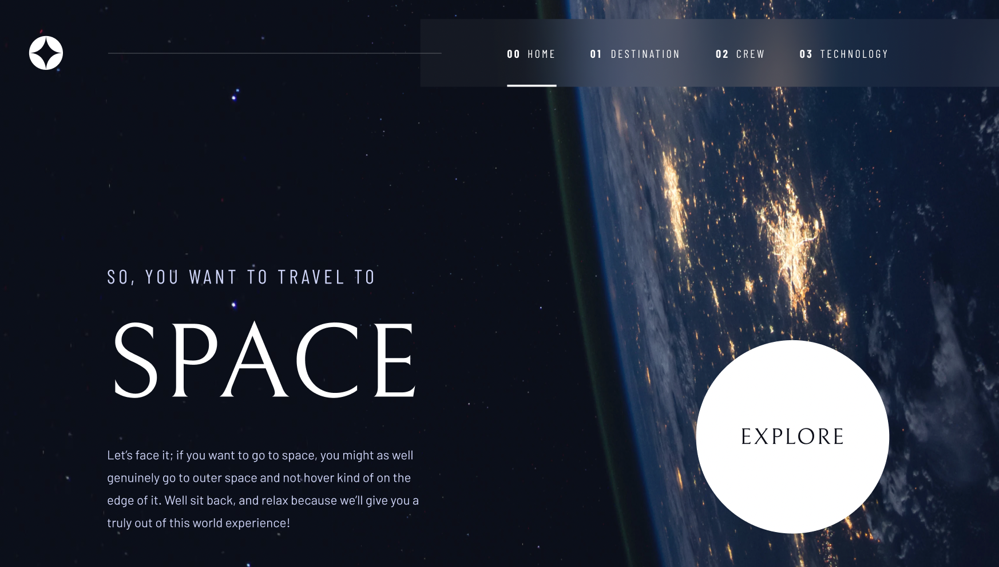
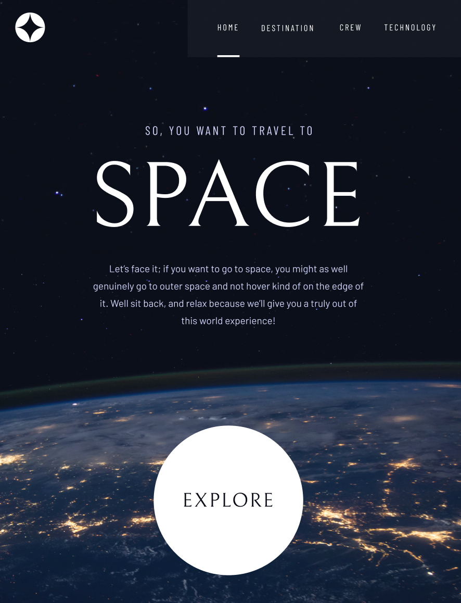
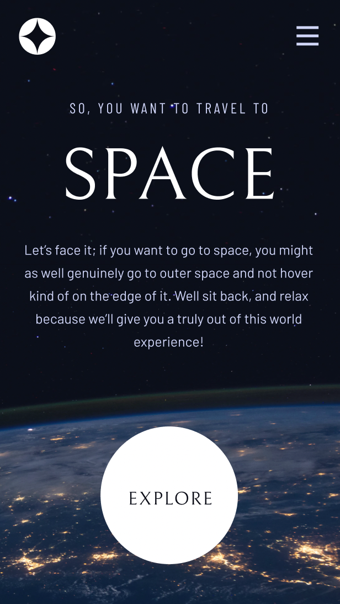
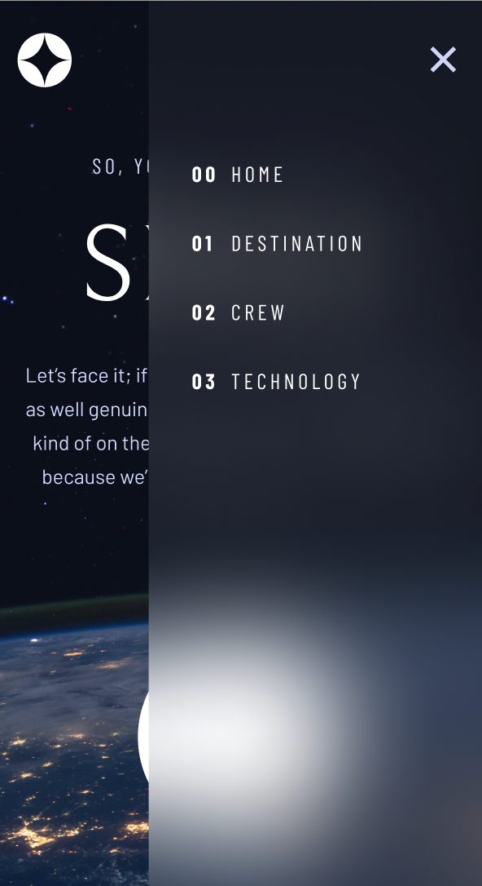

# Space tourism website solution

- Live Site URL: [Demo](https://tourtospace.netlify.app)
- Frontend website that stimulate a tour for space enthusiasts.
- The site is divided into several sections, including a welcome page, a destination page that introduces the major planets, a crew page that introduces the crew of the mission, and a technology page that explains the technology used in space exploration.

## Table of contents

- [Overview](#overview)
  - [The challenge](#the-challenge)
  - [Screenshot](#screenshot)
- [My process](#my-process)
  - [Built with](#built-with)
- [Author](#author)

## Overview

### The challenge

Users should be able to:

- View the optimal layout for each of the website's pages depending on their device's screen size
- See hover states for all interactive elements on the page
- View each page and be able to toggle between the tabs to see new information

### Screenshot

#### 1. Main page - Desktop

#### 2. Main page - Tablet

#### 3. Main page - Mobile

#### 4. Main page - Mobile with Navigation

### Built with

- Semantic HTML5 markup
- CSS custom properties
- Flexbox
- Javascript
- Bootstrap 5

## Author

- Linkedin - (https://www.linkedin.com/in/truc-nguyen-480222230/)
- Github - (https://github.com/trucn0311)
